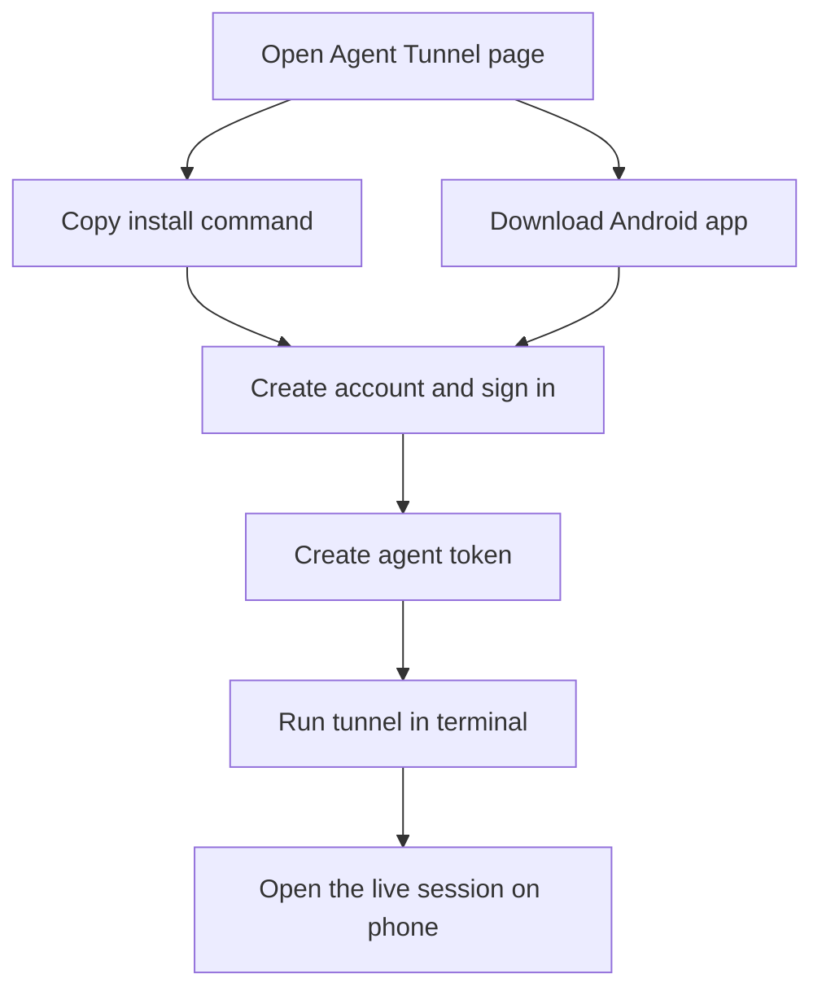

# Agent Tunnel Private Landing Page

## Problem Frame
Agent Tunnel needs a single landing page for invited users who already have access and just need to understand what the product is and how to start using it quickly. This page is not a public marketing site and it is not a web product surface. Its job is to make the first-run path obvious: get the app, install `tunnel`, sign in, create a token, start a session, and continue from the phone.

## Requirements

**Positioning**
- R1. The page shall present Agent Tunnel as a private onboarding page for using local agent sessions from a phone, not as a public marketing site or a web app.
- R2. The page shall use English throughout and keep the copy concise, technical, and product-facing.
- R3. The page shall use the product name `Agent Tunnel`.
- R4. The page shall describe the product in open-ended terms such as `your agent` or `the CLI agents you already run` and shall not present a closed support matrix for specific agent brands.

**Primary Actions**
- R5. The hero shall communicate the core value proposition within the first screen: using a phone to view and operate an agent that is running locally.
- R6. The hero shall include a prominent terminal-style install block for `tunnel` using a single `curl | bash` style command pattern.
- R7. The page shall provide an Android download action for the app and an iOS `Coming soon` placeholder.
- R8. The first release may use placeholders for the install command target, Android download target, and iOS target rather than inventing final destinations.

**Proof And Onboarding**
- R9. The page shall include a dedicated product-demo section for a how-to video, and the first release shall render this section as a clear placeholder because no video exists yet.
- R10. The page shall explain the onboarding flow in a short sequence covering: install the app and `tunnel`, create or sign into an account, create an agent token, run `tunnel`, and open the live session from the phone.
- R11. The page shall include at least one terminal-style usage example showing how `tunnel` is run after token creation.
- R12. The page may include screenshots of real agent launch states as product proof, but those screenshots shall illustrate examples rather than define an exhaustive supported-agent list.

**Page Shape**
- R13. The experience shall be a single scrolling page rather than a multi-page site.
- R14. The page shall stay intentionally small and shall not include secondary destinations such as Docs, Blog, GitHub, pricing, or a web login flow.

**Visual Direction**
- R15. The page shall use a modern technical product aesthetic that feels closer to strong Silicon Valley CLI product pages than to a personal homepage, with credibility coming from real terminal or app UI motifs rather than generic marketing chrome.

## Success Criteria
- An invited user can understand what Agent Tunnel is within the first screen.
- An invited user can find the install command and Android download without hunting through the page.
- A first-time visitor can explain the basic start flow after one read-through.
- The page feels like a credible technical product page without pretending there is a broader public product surface than currently exists.

## Scope Boundaries
- No web client, browser session surface, or implied web version.
- No public-access funnel such as waitlist, contact sales, or open signup marketing.
- No Docs, Blog, GitHub, changelog, pricing, or community sections.
- No iOS onboarding flow beyond a simple placeholder.
- No produced demo video in this phase; only the reserved section and placeholder state.

## Key Decisions
- Private onboarding page over public marketing site: the page is for invited users who already know where it came from.
- Single-page layout over multi-page navigation: the user should get the whole story in one pass.
- Install command plus Android download as the main actions: the page should get users into the product, not into secondary reading.
- English copy and a technical product aesthetic: the tone should feel closer to strong CLI product pages than to a personal project page.
- Screenshot proof is allowed, but support claims remain intentionally open-ended.
- Missing assets are handled with explicit placeholders in v1 instead of fabricated links.

## Dependencies / Assumptions
- Real install-script URL, Android download URL, and product video are not available yet.
- Visitors already have private access through the founder and do not need the page to explain public discovery or permission flow.
- Existing Android and terminal experiences can provide real screenshots later.

## Outstanding Questions

### Resolve Before Planning
- None.

### Deferred to Planning
- [Affects R8][Needs research] What placeholder treatment should be used for not-yet-live install and download targets so the UI stays honest without feeling broken?
- [Affects R9][Needs research] Should the v1 video placeholder stand alone, or should it be paired with still screenshots to keep the page from feeling empty before the demo video exists?

## Next Steps
-> /prompts:ce-plan for structured implementation planning
