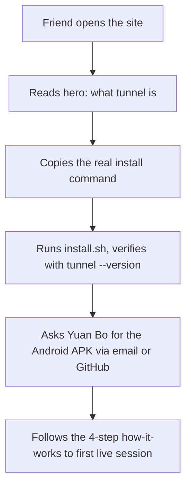

# Agent Tunnel v1 — Friends-Only Landing Page

## Problem Frame

The current site is wired with placeholders (video, APK link, iOS, install URL) that no longer reflect reality. Yuan Bo wants to share the page with a small group of invited friends so they can install the `tunnel` CLI, request the Android app, and learn the session flow. This is not a brand site and there is no public APK store listing — the page should stop pretending otherwise and present what actually exists, in a geek-native voice.

## User Flow

## Requirements

**Install strip (real, not placeholder)**
- R1. Replace the install command with the real one from `tunnel/README.md`: `curl -fsSL https://raw.githubusercontent.com/yuanbohan/tunnel/main/install.sh | sh`.
- R2. Remove the "URL pending" status chip and the "Replace the placeholder URL later" note. The command is real now.
- R3. Add a short verify-install line under the command showing `tunnel --version` and noting the binary is written to `~/.local/bin/tunnel`. Keep it as a small monospace caption, not a second hero element.

**Proof section**
- R4. Remove the entire proof section (the `Product proof` block, the video placeholder, and the duplicated screenshot cards). The two Android screenshots continue to appear as device frames inside the hero visuals, so proof is not lost. When the walkthrough video exists, a new proof section will be reintroduced with a different layout.

**Android / iOS distribution**
- R5. Remove the Android APK and iOS CTA buttons from the install strip. No public APK URL exists, and there is no iOS build.
- R6. Add a compact "Get the Android app" card after the how-it-works section explaining that the APK is invite-only, with two contact affordances: a `mailto:yuanbo.han@gmail.com` link and a link to `https://github.com/yuanbohan`. One short sentence of framing is enough; no form, no newsletter.

**Geek-native tone**
- R7. Keep the existing dark grid + Chivo + IBM Plex Mono aesthetic. Do not introduce brand-site tropes (gradients, marquees, hero badges, trust logos, stats counters). Lean the copy further into plain-spoken developer voice; avoid marketing superlatives.
- R8. Keep the `Private preview` pill in the hero — it accurately signals the invite-only stage and fits the geek voice.
- R9. Update the footer note to match the current reality: it should no longer reference swapping in an install URL or Android APK, since those are resolved or deferred. A one-line footer that names the project and the early-stage status is enough.

**Copy corrections from placeholders**
- R10. Update `proof` leftovers and any remaining placeholder language in `src/site-content.js` so the page no longer promises a video, an APK link, or an iOS build. The `README.md` in this repo should also be updated to reflect that the install command and proof section are no longer placeholders.

## Success Criteria

- A friend landing on the page can, in under a minute, copy a working install command and know exactly how to ask for the APK.
- No element on the page promises something that does not exist (no "coming soon" video, no disabled APK button, no iOS chip).
- The page still reads as a developer's project page — terminal-forward, no marketing scaffolding — when shared in a group chat.
- Playwright smoke tests (`npm test`) pass after the content and structural changes.

## Scope Boundaries

- No walkthrough video, no video placeholder, no "video coming soon" framing. The video section returns in a later revision when the file exists.
- No iOS surface of any kind.
- No signup form, analytics, invite-code gate, or newsletter.
- No expansion of the tunnel↔relay compatibility matrix or supported-targets list onto the site. Those stay in `tunnel/README.md`; the site links out when it needs to.
- No change to build tooling, Vite config, or test harness beyond what the content changes require.

## Key Decisions

- **Drop the whole proof section instead of reshuffling.** The video placeholder was the main reason for the two-column layout; with it gone, the screenshots are already carried by the hero visuals. Keeping a half-empty proof section would read as unfinished. Rationale: when the video lands, a fresh layout decision is cheaper than maintaining a transitional one.
- **APK via direct contact, not a hosted link.** Yuan Bo is inviting friends personally and wants to control distribution. A public APK link would invite trust questions the page cannot answer yet. Email + GitHub is enough for the current audience.
- **Email + GitHub, not Telegram/WeChat.** Chosen by the user. Email is universal; GitHub anchors identity. Accept modest mailto-scraping risk given the audience size.
- **Verify-install caption instead of a full spec block.** Of the extra README details (targets, version pin, verify, compat), only the verify step directly helps a friend confirm the install worked. The others are one click away in the tunnel repo.
- **Keep the "Private preview" pill.** It matches the invite-only reality and is geek-appropriate. No change.

## Dependencies / Assumptions

- The `tunnel` install script URL is stable on `main`; the page hard-codes it as the canonical install command.
- `public/images/agent-tunnel-session-list.png` and `agent-tunnel-session-detail.png` remain the two hero device-frame screenshots.
- `yuanbo.han@gmail.com` is acceptable as a public mailto.

## Outstanding Questions

### Deferred to Planning
- [Affects R4][Technical] Whether to delete the proof-related fields from `src/site-content.js` and the matching blocks in `src/main.js` and `src/styles.css`, or keep the CSS/content scaffolding commented out for the later video return. Recommend deleting now and reintroducing fresh when the video exists.
- [Affects R6][Technical] Exact placement and markup of the contact card — a new section between `how-it-works` and the footer vs. an expanded footer. Planning can pick based on existing section rhythm.
- [Affects R10][Technical] Which Playwright tests currently assert on `data-testid="video-placeholder"` or APK/iOS CTAs and need updating or removal.

## Next Steps

→ `/ce:plan` for structured implementation planning
