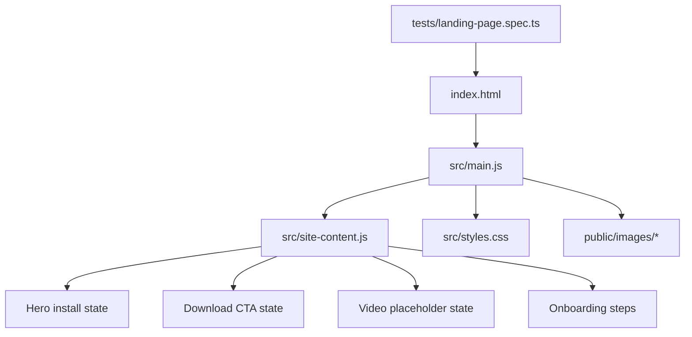

# feat: Build the Agent Tunnel private landing page

## Overview

Build a single-page landing site for invited Agent Tunnel users that explains the product quickly, puts the install command and Android download at the center, and reserves honest placeholder states for assets that do not exist yet. The implementation should favor a low-carrying-cost static site shape while still leaving room for responsive polish, first-party screenshots, and browser-based smoke coverage.

## Problem Frame

The repo currently has no web implementation, no frontend stack, and no reusable patterns to extend. The plan therefore needs to choose the smallest site foundation that can still deliver a credible technical product page, support placeholder and live asset states cleanly, and stay easy to revise once real install, download, and video URLs exist. Product intent and scope come from the origin document and should remain narrow: private onboarding, not public marketing, not a web client surface (see origin: `docs/brainstorms/2026-04-12-agent-tunnel-private-landing-page-requirements.md`).

## Requirements Trace

- R1, R5. Present Agent Tunnel as a private onboarding page and make the core value proposition legible in the first screen.
- R2, R3, R15. Use concise English copy and a modern technical product aesthetic closer to strong CLI product pages than a personal homepage.
- R4, R12. Keep agent support wording open-ended and use examples as proof rather than a closed support list.
- R6, R8. Show a prominent install command pattern while handling the missing final install URL honestly.
- R7. Provide Android download prominence and an iOS coming-soon state.
- R9. Reserve a video section without pretending a real video exists.
- R10, R11. Explain the start flow and show a realistic terminal usage example.
- R13, R14. Keep the experience as a single scrolling page with no secondary destinations or implied web product.

## Scope Boundaries

- No multi-page navigation or web app routes.
- No login form, docs hub, blog, pricing, GitHub, or public signup funnel.
- No real iOS flow beyond a passive placeholder.
- No fabricated live URLs for install, Android download, or video playback.
- No attempt to define or test a full supported-agent matrix.

## Context & Research

### Relevant Code and Patterns

- No existing frontend code, manifest, or site structure exists in this repository yet.
- The repository currently contains only the brainstorm artifact in `docs/brainstorms/2026-04-12-agent-tunnel-private-landing-page-requirements.md`.
- Because there is no in-repo pattern to follow, the implementation should establish a minimal static-site convention and keep the file layout shallow.
- First-party Android screenshots already exist outside this repo from current product debugging work, which makes a screenshot-backed proof section viable without waiting for the future demo video.

### Institutional Learnings

- No `docs/solutions/` directory or prior solution artifacts exist in this repository, so there are no local institutional learnings to inherit.

### External References

- `https://ampcode.com/` -- useful for hero clarity, install-command prominence, and product-proof rhythm.
- `https://paseo.sh/` -- useful as a reference for a technically credible product page with concise explanation and polished presentation.

## Key Technical Decisions

- Use Vite with vanilla HTML, CSS, and JavaScript instead of a framework-heavy stack:
  this repository is greenfield and the page is intentionally small, so the site should stay easy to ship and maintain while still supporting local preview, asset handling, and browser-based smoke tests.
- Represent not-yet-live destinations through explicit placeholder states rather than fake URLs:
  the install command block should visibly look like the final command shape but carry a clear placeholder label and non-live interaction state; Android and iOS cards should distinguish `link pending` from `coming soon`.
- Pair the video placeholder with first-party screenshots:
  a video-only placeholder risks making the page feel unfinished, while real screenshots from the Android experience and terminal sessions provide immediate product proof.
- Centralize copy and availability flags in one small site-content module:
  install text, CTA labels, placeholder status, and media inventory should live in one place so swapping real assets later does not require hunting across templates.
- Keep the page architecture strictly single-page:
  all sections should render from one entry point in a clear scroll order: hero, primary actions, product proof, onboarding steps, and lightweight FAQ/footer.

## Open Questions

### Resolved During Planning

- Which site foundation should the repo adopt?
  Vite plus vanilla HTML/CSS/JS, with no framework abstraction.
- How should missing install and download destinations appear?
  Render them as explicitly labeled placeholder states with disabled or non-navigating interactions, never as fake working links.
- Should the video placeholder stand alone?
  No. Pair it with first-party screenshots so the proof section still carries product credibility before a video exists.
- How should invited-only access be communicated?
  Keep it in the onboarding copy and flow steps, not as a dedicated top-level CTA.
- Should the page list specific supported agent brands?
  No. Use open-ended wording and optional screenshot examples only.

### Deferred to Implementation

- Exact screenshot selection, crop, and ordering should be decided when the actual assets are copied into this repo.
- The final install-script URL, Android APK URL, and future iOS destination remain pending and should replace placeholder flags without changing page structure.
- Final microcopy length may need one visual pass after real assets are in place, especially around hero text and CTA labels.

## High-Level Technical Design

> *This illustrates the intended approach and is directional guidance for review, not implementation specification. The implementing agent should treat it as context, not code to reproduce.*

## Implementation Units

- [ ] **Unit 1: Establish the landing page foundation**

**Goal:** Create the smallest maintainable frontend foundation for a polished single-page site in an otherwise empty repository.

**Requirements:** R1, R2, R13, R15

**Dependencies:** None

**Files:**
- Create: `package.json`
- Create: `vite.config.js`
- Create: `index.html`
- Create: `src/main.js`
- Create: `src/styles.css`
- Create: `src/site-content.js`
- Create: `README.md`

**Approach:**
- Set up a Vite-powered static page with one HTML entry and one small JS boot file.
- Keep shared copy, CTA availability flags, and media metadata in `src/site-content.js` so placeholder-to-live swaps stay low-risk.
- Establish the design tokens and layout primitives in `src/styles.css` early so later sections reuse one visual system rather than accumulating ad hoc section styling.
- Document the repo's minimal preview, build, and asset-swap expectations in `README.md`.

**Patterns to follow:**
- No in-repo pattern exists yet; establish a flat, static-site convention and reuse it consistently.

**Test scenarios:**
- Test expectation: none -- this unit is scaffolding and shared structure. Behavioral coverage begins once the page sections exist.

**Verification:**
- The repo can render one static page locally through the chosen site foundation, and the placeholder content model is centralized instead of spread through markup.

- [ ] **Unit 2: Build the first-screen hero and primary actions**

**Goal:** Deliver the page's highest-priority content in the first screen: value proposition, install command pattern, Android download emphasis, and iOS placeholder.

**Requirements:** R1, R3, R5, R6, R7, R8, R15

**Dependencies:** Unit 1

**Files:**
- Modify: `index.html`
- Modify: `src/main.js`
- Modify: `src/styles.css`
- Modify: `src/site-content.js`
- Test: `tests/landing-page.spec.ts`

**Approach:**
- Compose a hero that reads like a private onboarding entry point, not a marketing splash.
- Use a terminal-style install block for the `curl | bash` pattern and visually separate the command shape from its placeholder status so the section remains useful without pretending the command is live.
- Make Android the primary action and iOS a clearly subordinate `Coming soon` state.
- Keep the first screen lean: headline, short support sentence, install block, and the two platform actions.

**Patterns to follow:**
- External rhythm reference from `https://ampcode.com/` for install-command prominence.
- The copy constraints and scope limits from the origin doc.

**Test scenarios:**
- Happy path: on desktop width, the first viewport shows the headline, install block, and Android CTA without requiring a scroll to discover them.
- Happy path: on mobile width, the install block remains readable without horizontal clipping and the Android and iOS actions remain visible as distinct states.
- Edge case: when the install destination is unavailable, the command block renders its placeholder label and does not expose a fake working navigation target.
- Edge case: when the Android destination is unavailable, the Android CTA still communicates its intended role without looking identical to the passive iOS placeholder.
- Integration: hero copy and CTA labels do not imply a web client, docs hub, or public signup flow.

**Verification:**
- The page's first screen alone tells an invited user what Agent Tunnel is and where to start.

- [ ] **Unit 3: Add the proof and onboarding sections**

**Goal:** Show what the product looks like and explain the real-world start flow without overbuilding the site.

**Requirements:** R4, R9, R10, R11, R12, R14, R15

**Dependencies:** Unit 2

**Files:**
- Modify: `index.html`
- Modify: `src/main.js`
- Modify: `src/styles.css`
- Modify: `src/site-content.js`
- Create: `public/images/agent-tunnel-session-list.png`
- Create: `public/images/agent-tunnel-session-detail.png`
- Test: `tests/landing-page.spec.ts`

**Approach:**
- Add a proof section that combines a video placeholder card with one or more first-party screenshots so the product feels real before the video exists.
- Use onboarding steps that mirror the actual flow from the existing product: download app, create or sign into account, create token, run `tunnel`, open the session on the phone.
- Include one realistic terminal usage example beneath or within the onboarding section.
- Keep screenshot examples illustrative and label them as examples rather than "supported agents".
- Add a lightweight FAQ or closing section only for practical clarifications, such as private-access framing and future iOS status.

**Patterns to follow:**
- External rhythm reference from `https://paseo.sh/` for section pacing without adding unnecessary destinations.
- Existing first-party product visuals rather than stock imagery or abstract hero decoration.

**Test scenarios:**
- Happy path: the proof section renders at least one screenshot and one video placeholder region with visible labels.
- Happy path: the onboarding section renders the full sequence from account access through opening a live session on the phone.
- Edge case: when no video source exists, the proof section renders a deliberate placeholder state rather than an empty or broken media player.
- Edge case: when fewer screenshots are available than originally planned, the screenshot layout remains balanced instead of leaving broken gaps.
- Integration: the onboarding steps, terminal example, and FAQ stay consistent with the private, non-web scope and do not introduce extra destinations.

**Verification:**
- A first-time invited visitor can scroll once through the page and explain both what the product looks like and how to start using it.

- [ ] **Unit 4: Add accessibility semantics, responsive polish, and browser smoke coverage**

**Goal:** Make the page trustworthy across common viewports and lock in the placeholder-state behaviors with lightweight browser tests.

**Requirements:** R2, R5, R7, R8, R9, R13, R15

**Dependencies:** Unit 3

**Files:**
- Modify: `src/main.js`
- Modify: `src/styles.css`
- Modify: `src/site-content.js`
- Create: `playwright.config.ts`
- Create: `tests/landing-page.spec.ts`

**Approach:**
- Add accessible semantics for disabled placeholder actions, media labels, and screenshot alt text so the page reads as intentional rather than incomplete.
- Tune spacing and typography for mobile and desktop so the hero remains compact and the later sections do not collapse into card soup.
- Use Playwright for a small browser smoke suite that asserts the presence and state of the core onboarding elements and captures screenshots for layout review.
- Keep the test suite focused on the few behaviors that matter here: section visibility, placeholder honesty, and responsive stability.

**Execution note:** Start with a failing browser smoke spec that asserts the first-screen and placeholder-state expectations before final polish.

**Patterns to follow:**
- Browser-level verification for user-facing layout and interaction states rather than unit-level JS tests.

**Test scenarios:**
- Happy path: desktop and mobile renders both include the headline, install block, Android action, proof section, and onboarding sequence.
- Edge case: disabled placeholder actions expose disabled semantics and do not navigate when clicked.
- Edge case: long install-command text and terminal example text stay within their containers on narrow mobile widths.
- Integration: browser smoke tests confirm the page still avoids web-app affordances such as login forms, docs links, or extra routes.
- Integration: screenshot-based review confirms the page keeps a technical product feel and does not regress into generic placeholder-heavy sections.

**Verification:**
- The page can be previewed locally, passes its smoke checks, and holds together visually on at least one desktop and one mobile viewport.

## System-Wide Impact

- **Interaction graph:** The site is a static browser-rendered page with no backend dependency or runtime data fetches. All user-visible states come from local content and asset availability flags.
- **Error propagation:** Missing URLs or media should resolve to labeled placeholder UI, not runtime errors, broken embeds, or dead-looking blank areas.
- **State lifecycle risks:** The main state risk is drift between real asset availability and the content flags that drive placeholder rendering; centralizing that metadata reduces mismatch risk.
- **API surface parity:** None. This work must not imply a web session surface or change the actual product contract.
- **Integration coverage:** Browser smoke coverage should validate viewport layout, placeholder CTA semantics, and asset-absent rendering together, since visual sections depend on shared styling and content flags.
- **Unchanged invariants:** Agent Tunnel remains a private onboarding experience with Android plus terminal usage at the center. This site does not add docs, auth flows, or browser session support.

## Risks & Dependencies

| Risk | Mitigation |
|------|------------|
| Placeholder-heavy content reads as unfinished instead of intentional | Use explicit status labels, pair placeholders with real screenshots, and avoid fake live links |
| A framework choice adds unnecessary maintenance burden to a one-page site | Keep the stack to Vite plus vanilla HTML/CSS/JS and avoid component-library abstraction |
| Real URLs and video arrive later and require structural rewrites | Centralize availability flags and CTA copy in `src/site-content.js` so later swaps are data changes, not layout rewrites |
| Greenfield styling drifts into generic landing-page chrome | Ground the page in terminal motifs, first-party screenshots, and the private onboarding scope from the origin document |

## Documentation / Operational Notes

- `README.md` should document local preview, build, and smoke-test entry points once the site scaffold exists.
- The repo should keep placeholder/live asset toggles easy to locate so later updates can replace dummy states quickly.
- When the real demo video is ready, it should drop into the existing proof section without changing page order or CTA hierarchy.

## Sources & References

- **Origin document:** [docs/brainstorms/2026-04-12-agent-tunnel-private-landing-page-requirements.md](docs/brainstorms/2026-04-12-agent-tunnel-private-landing-page-requirements.md)
- Related code: none in this repo yet; implementation begins greenfield.
- External docs: `https://ampcode.com/`
- External docs: `https://paseo.sh/`
